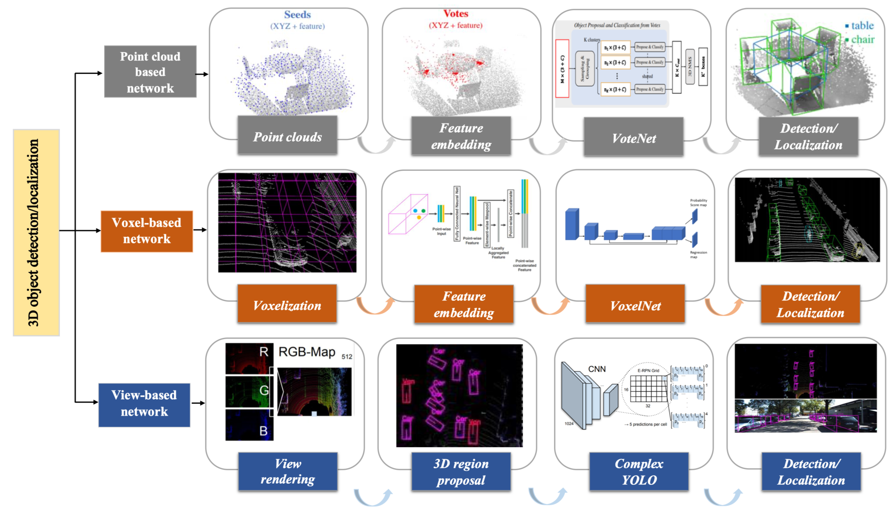
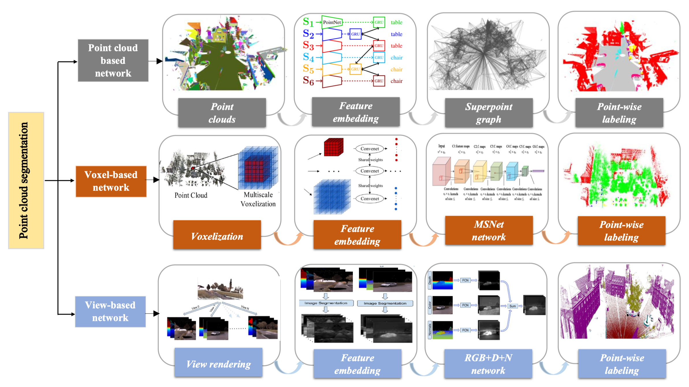
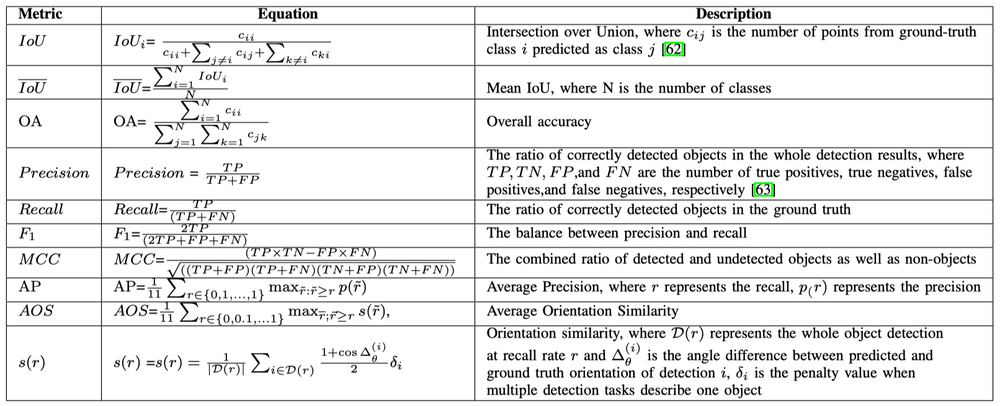

# Deep-Learning-for-LiDAR-Point-Clouds

This repo is based on our new review paper ***"Deep learning for LiDAR point clouds in autonomous driving: a review." IEEE Transactions on Neural Networks and Learning Systems (2020)*** 


## Object Detection

[LiDAR Detection Paper List](md/Detection.md)



## Semantic Segmentation

[LiDAR Segmentation Paper List](md/Segmentation.md)



## Datasets

[Datasets List](md/Datasets.md)

Evalation Metrics:




## Citation

If you find our work useful in your research, please consider citing:

```
@article{li2020deep,
  title={Deep learning for LiDAR point clouds in autonomous driving: a review},
  author={Li, Ying and Ma, Lingfei and Zhong, Zilong and Liu, Fei and Chapman, Michael A and Cao, Dongpu and Li, Jonathan},
  journal={IEEE Transactions on Neural Networks and Learning Systems},
  year={2020},
  publisher={IEEE}
}
```
